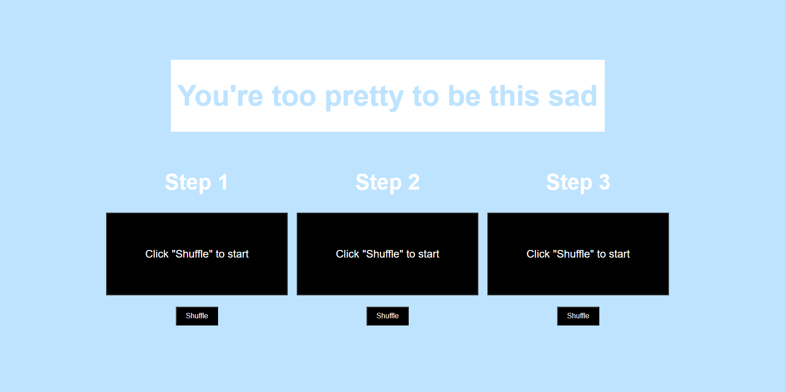

# You're Too Pretty To Be Sad  
*A Simple Self-Care Shuffle Tool*

## 🌼 Description

**You're Too Pretty To Be Sad** is a lightweight self-care web application designed to offer gentle, actionable reminders when life feels overwhelming. With just a click, users can shuffle through three personalized steps to ground themselves, feel supported, and take a small step toward feeling better.

Whether you’re stuck in a spiral or just need a mental reset, this site reminds you: **you’re worth the care**.



---

## Deployed Application

https://shs-peb.github.io/You-re-too-pretty-to-be-sad/

---

## Features

- Shuffle button for each of the 3 steps
- Randomized self-care suggestions from a curated list
- Soft, calming UI with motivational messaging
- Fast and simple – no login or downloads required

---

## Built With

- **HTML5**
- **CSS3**
- **Vanilla JavaScript**

---

##  How It Works

Each of the three steps includes a "Shuffle" button. When clicked, it randomly displays a helpful self-care suggestion from a small but meaningful list, such as:

The concept is simple: **start small, take action, and feel better**.

---

## How to run

To run this project locally:

1. Clone the repository:
   ```bash
   git clone https://github.com/shs-peb/You-re-too-pretty-to-be-sad.git
   
2. Navigate into the project directory:
   ```bash
   cd You-re-too-pretty-to-be-sad

3. Open index.html in your browser.
